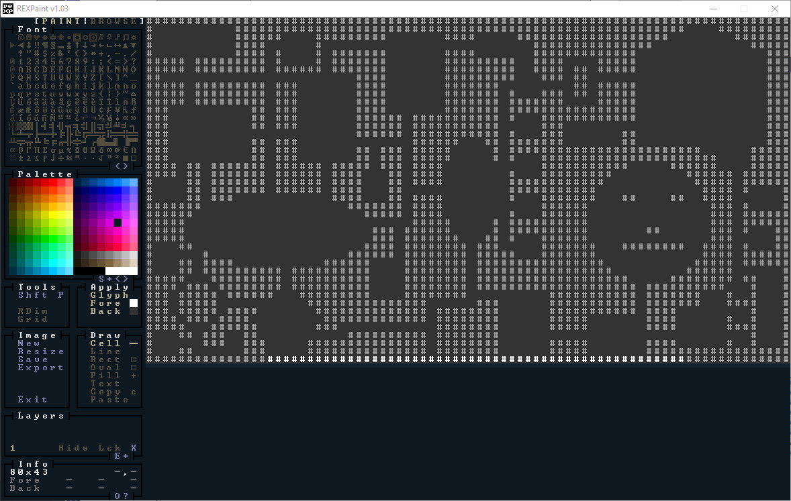

https://bfnightly.bracketproductions.com/chapter_10.html

1 将rust 代码 编译魏WASM  被游览器运行，将js 文件（是不是rust 被编译为js 文件），将rust在窗口中显示的内容显示到浏览器中，bindgen 
rltk 是 rouglike 的 工具包
2，在浏览器运行本地的html  和 js 文件，需要打开本地的web 服务

3，浏览器的兼容问题，谷歌浏览器

４，元组的join　类似database（数据表）的join，

如何创建lib 库 

git config --global core.autocrlf true
git add .
git commit -m ''
git push

## 2.1 实体和组件
## 2.4. Field of View
随着人物的移动逐渐显示地图，将人物周围一定范围内的地图显示出来，其余全部都是黑色，代表呗人物看到的范围
map refactor  ,将与地图相关的数据和函数放在一个，struct map , impl map， 这样可以直接传递map 给使用者，而不是描述地图的一个 vector （一个数据类型）

the filed of view component 视场的组件
不止玩家有可见范围，而且怪物也是有的，所以 因为特性相同，所以可将这个特性抽象为一个组件，Viewshed component （我可以从这个世界看到什么）
在 struct Viewshed 中，有一个 list 代表哪些title 可以被拥有这个组件的entiy 看到，

将新的组件注册到ecs 中，
将Viewshed 组件添加到players中

a new system: generic viewsheds（通用视域）
系统中处理的数据也需要一个struct  来抽象保存
然后为这个系统impl  System 这个 trait
pub struct VisibilitySystem {}
impl<'a> System<'a> for VisibilitySystem 

调用系统，

ask RLTK（一个游戏的组件） for a viewshed: trait implementation 特征的实现

我们自己定义的地图被RLTK 正常使用，需要我们为map 实现一部分 RLTK 提供的trait


map 中有哪些内容，地图中title 的特性，分类，哪些玩家还没探索，不可见的，哪些探索了但是玩家看不到的（灰色），那些是玩家看到的
优化性能，标志位，什么时候渲染，什么时候不渲染，是不是每帧都需要渲染重复的东西，更新每个title的状态，如果玩家没有移动，那么他的可见范围还是这样，不会改变，那么这些可见范围内的title 的状态和标志不需要再改变，

是为了保存状态，信息，

## 2.5 monster
1，rendering a monster in the center ot each room
怪物有renderable 组件，有 viewshed 组件，

我们需要再player 看到monster 的时候，才渲染怪物，
因为monster 也是地图的一部分，所以我们只需要检查（遍历）这个怪物 图块是否可见，可见才渲染，

2，add some monster variety
g oblins（哥布林） 和 o rcs（半兽人）
monster spawner 怪物生成器
随机生成不同的种类的怪物，

3，make the monster think（怪物的AI）
怪物的AI是不是可以使用模型来进行训练，一部分来作为怪物，一部人来作为，

怪物只会在玩家移动是进行思考，
You could let monsters think every time anything moves (and you probably will when you get into deeper simulation), but for now lets quiet them down a bit - and have them react if they can see the player.

如何 修改commit 

在网上发布的一些文章，有时候只是需要有，而不是文笔怎样，怎样声情并茂，而是陈述什么事情，把一些必要的信息列出来，然后加上一些常见的套话，

一些复杂的任务，需要记录下来，形成文本，这样 都有一个基本，都可以一起看，一起讨论，确定具体的做法，然后开始行动，而不是在哪里讨论什么该如何做，


有些人，可以暂时的赚了一部分钱，但是因为一些人生的脚本，这些钱并不会被留在在他的手上，他最后还是会败尽家财


## 2.6 Dealing Damage
教程链接
https://bfnightly.bracketproductions.com/chapter_9.html

Specs 的 教程链接
https://specs.amethyst.rs/docs/tutorials/01_intro

## 2.6 Dealing Damage
1, monster chase player
monster 的行动路径，哪些房间是可以走过的
RLTK 提供了 BaseMap trait  需要我们的 Map 实现 BaseMap

2，怪物不会走在各自身上，也不会走在玩家的身上，而且不会被阻塞在某一个地方
地图的图块一个新的属性，是否被阻塞pub blocked : Vec<bool>
这个图块是否被堵塞，TileType::Wall 是会被阻塞的
如果图块被阻塞blocked，那么不能exit

3，新的组件BlocksTile，注册组件, player and monster both have BlocksTile component

4，填充blocked list，
系统map_indexing_system.rs
将所有有BlocksTile 组件的tile 添加到地图的blocked list
将这个系统注册到 run_system 
怪物只有距离玩家一段距离才会yell(大叫)
防止玩家从怪物身上走过

5，斜线运动
怪物斜线运动，玩家斜线运动

6，战斗状态
CombatStats Component hp defense power 
给玩家添加战斗状态，

7，indexing what is where ,知道图块（tile）上的内容map 的 tile_content 存储tile 上的内容，
map_indexing_sytem 系统，知道tile上有哪些内容
通过 map tile 索引所有的实体 ，将tile 上的实体添加到tile_content上

8，让player hit things
Bump to attack (walking into the target) is the canonical way to do this. 走到目标的位置
检查玩家走进的tile 是否包含目标
you can walk up to a mob and try to move onto it


9，player attacking and killing things
表示攻击意图的组件，WantsToMelee 
玩家可能遭受多个攻击源，但是Specs 不想将同一个组件多次添加到实体上
所以讲咩一个攻击作为一个实体，要么一个变量存储所有的攻击
选择简单的后一个，SufferDamage component, to track the damage， 并为该组件 实现一个方法 使其易于使用

给玩家添加想要攻击的组件
MeleeCombatSyatem 系统 处理近战, melee 近战 new file melee_combat_system.rs

damage_system 来应用伤害，计算伤害值，new file damage_system.rs

DamageSystem 系统，计算收到的伤害
delete_the_dead 删掉死亡的实体，在tick commmand 中，每一帧都会检测，在系统运行之后

10 让monster hit you back 
只需要为怪物添加WantsToMelee 怪物 就可以攻击玩家

将玩家实体变为资源，这样我们才可以比较容易的引用使用
let player_entity = gs.ecs ... 
gs.ecs.insert(player_entity);

扩展 turn system 
怪物在收到致命伤害后还会继续攻击一次
添加系统状态，
将RunState 添加为资源
从ecs 中得到RunState， 然后根据状态执行逻辑,并修改状态
状态机
灵活使用作用域，将一些只需要使用席次的代码删除，或者只是为了得到数据A，然后将数据A的引用赋值给一个变量
传出去，然后将A删除


--------------------------------------------------------------------
## 2.7 User interface
1,收缩 Map, Shrinking the map,使用常量来设置map 的size
改变 map 的高度 43 ，留下一部分作为user interface

2,some minimal GUI elements 
创建 gui.rs ， draw_ui 在地图下方画一个box 作为UI

3,adding a health bar, 添加生命条，
RLTK provides a convenient helper 从ecs 中获得player 的生命值，然后渲染

4,adding a message log 
添加消息日志，日志作为一种资源，可以被任何系统访问，所有信息都可以告诉你信息

新建文件gamelog.rs，首先对日志进行建模，，struct GameLog
当作资源插入到 ecs 中

5,logging attacks
攻击日志，
change melee_combat_system -> run method

6 notifying of deaths 通知死亡信息死亡日志
修改 damage_system -> delete_the_dead method

6,鼠标支持和工具提示，mouse support,tooltips
鼠标点击地图上的 玩家或者怪物显示 提示

RLTK获取鼠标信息,将鼠标 指向的单元格的背景设置为洋红色

new method gui.rs -> draw_tooltip 
获取 tooltips 所需的组件 names and positions also gets read access to the map itself
检查 鼠标 是否在地图上, 如果不是 退出

if we have any tooltips, look at the mouse position, 如果鼠标的位置在右侧, put the 
tooltips to the right, otherwise to the left

7,optional post-processing 处理 for that truly retro feeling 显示一种复古的感觉
main context.with_post_scanlines

------------------------------------------------------------
## 2.8 items and inventory 物品和库存
在UI中添加　基本物品　拾取　使用 丢弃(drop)

2.8.1 thinking about composing items 组合物品
面向对象 和 实体组件系统的**区别是** 你不是考虑实体的继承，而是什么组件组合成了这个实体

so what makes up an item? 
thinking about it, an item can be said to have the following **properties** 
Renderable, draw it 
Position 
InPack, indicate this item is stored 
Item, which implies that it can be picked up 
if it can be used, the item need some way to indicate that it can be used

2.8.2 consistently random 始终随机
计算机本质上是确定性的 - 因此（无需涉及密码学的东西）当您要求“随机”数字时，您实际上得到的是“非常难以预测序列中的下一个数字”。该序列由种子控制 - 使用相同的种子，您总是会得到相同的骰子
make the RNG random number generator a resource, 作为一种资源，任何系统随时随地访问它
main  ecs.insert(....)

2.8.3 improved spawning 
优化怪物生成，支持生成物品
整理玩家 和 怪物生成代码， 将原来main.rs 中的 玩家和怪物生成代码都放入 spawner.rs


2.8.4 spawn all the things, spawn multiple monster per room,
怪物 物品 在房间内随机生成

2.8.5 health potion(药剂) entities,  
添加组件来帮助定义药水
add Item and Potion components to components.rs,register these in main.rs
add new function spawner ->health_potion
在房间中随机生成随机数量的potion

2.8.6 picking up items, 拾取物品， 
create component **InBackpack**, represent an item being in someone's backpack
玩家和怪物都可以失去物品，他们有一个拾取物品的列表，所以一个 componnent **WantToPickupItem** 来标记，
需要一个系统来处理 WantToPickupItem notices, 所以一个新的文件 inventory_system.rs inventory-库存
添加一个按键 g 拾取物品,add new function palyer.rs ->get_item()
按下G键位如果玩家的位置和物品的位置重合,拾取物品,物品移除 position 组件, 添加 WantsToPickupItem 组件

2.8.7 listing your inventory 列出库存，
列出库存的时候，游戏循环进入另一个状态，
extends main.rs -> RunMode
gui.rs -> show_inventory() gui 显示库存
I 键, 显示库存 inventory.
main.rs -> tick(), we'll add another matchin 添加匹配 ShowInventory
添加 show_inventory() in gui.rs

2.8.8 using items 使用物品
在库存中选中一个item  并使用 
extend the menu to return an item and a result
gui.rs -> show_inventory() gui 物品菜单栏的 按键操作 Escape
RunState::ShowInventory 打印选中物品的名字

玩家和 怪物 都可以使用物品 如 药水
add 意图组件 WantsToDrinkPotion

add PotionUseSystem in inventory_system.rs,this iterates all of the WantsToDrinkPotion intent objects, 然后回复 drinke 一定的生命值 Potion 
由于所有放置信息都附加到药水本身，因此无需四处寻找以确保将其从适当的背包中取出：该实体不再存在，并带走其组件。

使用 cargo run 进行测试会令人惊讶：该药水在使用后并没有被删除！这是因为 ECS 只是将实体标记为 dead - 它不会在系统中删除它们（以免弄乱迭代器和线程）。因此，在每次调用 dispatch(派遣) self.run_systems(); 之后，需要添加对 maintain 的调用。
```rust
RunState::PreRun => {
    self.run_systems(); // dispatch 系统
    self.ecs.maintain();
    newrunstate = RunState::AwaitingInput;
}
```

2.8.9 dropping items 从仓库丢弃物品
遵循 使用物品的模式，**create an intent component**,a meun to select it, and a system to perform the drop
WantsToDropItem components
add ItemDropSystem to the inventory_system  
显示 待丢弃物品的菜单 change the gui.rs, add in ShowDropItems
extend impl GameState for State, RunState::ShowDropItem => {....}

10 render order 渲染的顺序
药水显示在玩家的上方
add render_order filed to Renderable Component
player's render_order is 0
monster's render_order is 1

根据 render_order 进行渲染

change render section in tick method 

*每个项目都有对应的自己的文档*

## 2.9 Ranged Scrolls and Targeting 远程卷轴和目标

last chapter, we added items and inventory - and a single item, a health potion, now a second item type: a scroll of magic missile(魔法导弹卷轴), the lets you zap（攻击） an entiy at range

1，using components to describe what an item does 使用组件来描述项目的功能，组合组件

fot flexibility, we will start by breaking down items into a few more components types 

start with the simple flag component, Consumable component 可消耗的组件

PotionUseSystem -> ItemUseSystem

将Potion 组件 修改为 ProvidsHealing Component, 

change the spawner.rs -> health_potion()

2，describing ranged magic missile（导弹） scrolls, 描述远程魔法导弹卷轴
add more components and registeres in mian.rs, Ranged 范围 InfilctDamage 给予（使遭受）损坏

write magic_missile_sroll function in spawner.rs, describing the scroll 

add magic_missile_sroll function into the spawn list, spawner.rs -> random_item()

将生成物品的生成代码 health_potion 修改为 random_item

now, you'll find scrolls as well as potions lying around, the components system already provides quite a bit of functionality, 

you can see them rendered on the map(thanks to the **renderable** and **positon**)
you can pick them up and drop them(thanks to **item**)
you can list them in your **inventory**
you can call **use** on them, and they are destroyed: but nothing happens

3，implementing ranged damage for items 对物品实施远程伤害
want magic missile to be 可以瞄准，激活发射，然后选中一个 受害者，这是另一种的输入模式，添加运行状态 extend main.rs RunState add ShowTargeting 
extend main.rs -> match newrunstate -> ShowTargeting handle items that are ranged (存在ranged 组件的item ) and include mode switch (模式转换) to ShowTargeting gui绘制攻击选择菜单 gui::ranged_target, 攻击选择菜单, 显示视域, 鼠标选择攻击目标, 返回攻击目标的信息

extend mod.rs RunState::ShowTargeting 匹配

将使用药水的组件修改为WantsToUseItem 组件

将使用potion 系统改为 ItemUseSystem 修改 inventory_system.rs

ItemUseSystem 有使用不同物品的条件，如魔法导弹攻击，药水治疗，AOE攻击等

4 Introducing Area of Effect 引入范围攻击
add another scroll type Fireball, 引入 Aoe 伤害 
add a component AreaOfEffect, 存在攻击半径

extend spawner.rs -> random_item 增加一个item 

write a fireball_scroll function to actually spawn them, like other items

现在火球术 会对单体产生伤害，we must fix that，add new vector storage targets
extend inventory_system.rs ->  match useitem.target {

现在 所有的 物品 的使用目标都是 从对 targets 的迭代进行 获取 for target in targets.iter() {

5 Confusion Srolls 昏迷卷轴
add another item - confusion scrolls, will target a single item at ranged, make them confused for a few turns - during which time thay will do nothing. 
start by describing what we want in the item spawning code. extend spawner.rs -> fn confusion_scroll(ecs: &mut World, x: i32, y: i32) {

add a new Confusion   component (and register it!):

extend ItemUseSystem, add the ability to paas along confusion to the ItemUseSystem

存储 被confusion 的 目标的vector ，let mut add_confusion = Vec::new();

update the **monster_ai_system** to use Confusion status, Confused entity can not act,    if i_anm_confused.turns < 1 只有 Confused 中的 turns 被消耗为0，哪里在消耗这个turns, 怪物每次行动都会检查遍历 confused 存储器，如果存储器中有这个实体，就会  i_am_confused.turns -= 1;


## 2.10 Saving ang Loading 保存和加载
停止游戏然后继续游戏
1 A Main Menu 主菜单
resume a game
a main menu give option to abandon your last save, view credits（制作组)

being in the menu is a state, so extend RunState, include menu state inside it, MainMenu { menu_selection : gui::MainMenuSelection }, handle the new RunState,

in gui.rs, add couple of enum types to handle main menu selections, pub enum MainMenuSelection , pub enum MainMenuResult

handle the new RunState MainMenu, ensure that we are not also rendering the GUI and map when in the menu, rearrange（重新安排） GameState -> tick()

hadle MainMenu state, 处理处于 主菜单 状态 下的逻辑 RunState::MainMenu{ .. } => {}, if something has been selected, change the game state,
for quit, terminate the process, for now, loading/starting a game do the same thing: go into the PreRun state
to setup the game

the last thing to do is to write the menu itself, in gui.rs -> main_menu()

match ctx.key{}, displays menu options and lets you select them with up/down keys and enter, it is very careful to not modify state itself.

2 Including Serde（序列化）

Serde is pretty much the gold-standard for serialization in rust, in Cargo.toml inlcude serde and serde_json

cargo run, it will downloading the new dependencies and all of their dependencies.

3 Adding a SaveGame state
extend RunState add SaveGame
in tick, add RunState::SaveGame => {} 处理SaveState 状态下的逻辑 

in player.rs, add anthor keyboard handler - escape, press escape to quit the menu

4 Getting started with saving the game 开始保存游戏
now that the scaffolding is in place, it is  time to actually save something, 

in the tick function, we extend the save system to just dump(转储) a JSON representation of the map to the console, 将地图的json格式 转储在控制台

need to tell Map to serialize itself, 需要让Map 自己进行序列化, 对 struct Map 添加宏，也需要对 TileType 和 Rect 进行序列化

now when you hit escape it will dump a huge blob of JSON data to the console


地址，开还是断

5 Saving entity state, 保存实体状态
but because of Specs handles Entity 的方式，实体的ID 合成的，不能保证下次会得到相同的ID，
另外，我们可能不想保存所有的内容，所以，引入 specs 中的标记 markes 概念，它提供了一个非常强大的序列化系统

6 Introducing Markers 引入标记
main.rs to make use marker functionality
use specs::saveload::{SimpleMarker, SimpleMarkerAllocator};

in components.rs, add marker type pub struct SerializeMe, in main.rs, add SerializeMe to the list of things that we register

insert a marker entity as ECS resource

in spawner.rs, tell each entity builder to include the marker,.marked::<SimpleMarker<SerializeMe>>() needs to be repeated for all of your spawner in this file
use specs::saveload::{MarkedBuilder,SimpleMarker};

7 The ConverSaveload(转换保存加载) derive macro

Entity 类本身（由 Specs 提供）不能直接序列化， it's actually a **reference** to an identity in a special structure called a "slot map" 

 in order to save and load Entity classes, it becomes necessary to convert these synthetic（合成） identities to unique ID numbers.

Specs provides **a derive macro called ConvertSaveload for this purpose.** It works for most components, but not for all（但是不适合与所有的组件）

序列化一个没有实体但**有数据的类型**非常容易：用 #[derive(Component, ConvertSaveload, Clone)] 标记它。


#[derive(Component, ConvertSaveload, Clone)]
pub struct Position {
    pub x: i32,
    pub y: i32,
}
Clone 表示“这个结构可以在内存中从一个点复制到另一个点”。这对于 Serde 的内部工作是必要的，并且还允许您将 .clone() 附加到对组件的任何引用的末尾 - 并获得它的另一个完美副本

When you have a component with no data, the ConvertSaveload macro doesn't work! so can fall back to the default Serde syntax. Here's a non-data ("tag") class:

#[derive(Component, Serialize, Deserialize, Clone)]
pub struct Player {}

8 Actually saving something
move code for loading and saving into savedload_system.rs 

implementing save_game function, extend saveload_system.rs, 
bulid macro serialize_individually 解决Serde 和Specs 之间 协同工作的问题

creating a new component type - SerializationHelper that stores a copy of the map, then creates a new entity savehepler, and give it the new component SerializationHelper, 

savegame.json file has appeared with your game state in it,

9 Restoring Game State 恢复游戏状态
it is time load the game state

is there a saved game? 是否有被保存的游戏状态可以被加载，in saveload_system.rs, add funciton does_save_exist()

change 游戏加载的 ui 显示

in main.rs, 编写 游戏加载的逻辑

10 Actually loading the game 实际加载游戏
in saveload_system.rs, need another macro deserialize_individually,  serialize_individually 宏几乎相同 - 但相反的过程(反序列化)，并包括一些细微的变化：
extend saveload_system.rs -> load_game function, 将 savegame.json 数据编码 反序列化 ，然后将反序列的结果 转为 specs 组件, 替换 地图 资源，存储玩家和其位置的 世界资源

11 Just add permaddeath 添加永久性的死亡
roguelike 不会在你重新加载游戏后保存你的游戏存档，add delete_save() function to saveload_system.rs

add a call to mod.rs to delete the save after we load the game

12 Web Assembly 网络组装
wasm is sandboxed(沙盒)，does not have the ability to save files locally, 没有能力保存文件到本地

rust offers condition 条件编译，就是 C 语言 中 #define
仅在非 Web 汇编平台上时编译
#[cfg(not(target_arch = "wasm32"))]
pub fn save_game(ecs : &mut World) {}

now have a framework for loadin and saving the game whenever we want to, 
adding components has gained some steps: weh have to register them in main, tag them for Serialize, Deserialize, and add them to our components type lists in saveload_system.rs


## 2.11 Delving Deeper 
dungeon crawler 地牢探索者
this chapter weil introuce depth, with a new dungeon being spawned on each level down, 每个等级 都会生成一个地牢
we will track the player is depth, and encouraged ever-deeper exploration, 
what could possibly go wrong for the player?

1 Indicating - and storing - depth 指示和存储深度
adjust Map struct to include an integer fo depth，给Map添加深度属性

pub fn new_map_rooms_and_corridors(new_depth : i32) -> Map {}, 地图生成器可以创建其他level 的地图，所以为地图生成器函数添加一个参数 new_depth

that is, our maps now konw about depth, you will to delete any savegame.json files you have lying around, since we have changed the format - loading will fail

2 Showing the player their map depth 向玩家显示地图的深度
we will modify the player is heads-up-display to indicate the current map depth, in gui.rs, inside the draw_ui function

3 Adding down stairs 添加向下一层的楼梯
modify the enumeration TileType, add new one:down stairs

render the stairs, map.rs contains draw_map, and adding a tile type is a relatively simple task

lastly, place the down stairs(放置向下向上的楼梯), place up stairs in the center of the first room the map generates, place the stairs in the center of the last room, modify new_map_rooms_and_corridors function in map.rs

now, can find a set of down stairs on the map

4 Actually going down a level, 下降一层
in player.rs, 将下一级的操作绑定到 period 键位上（在美国键盘上，这是不带 Shift 的 > 键）,add new function try_next_level() into player.rs

add new RunState NextLevel, implemented the new RunState, 为新的游戏状态添加对应的逻辑 self.goto_next_level() 函数(State 的一个方法)

add a new impl section for State, so we can attach methods to it, create a new helper method(辅助函数) 
impl State{
    fn entities_to_remove_on_level_change(&mut self)->Vec<Entity>{

    }
}
when we go to the next level, we want to delete all entities - except the player and whatever equipment(装备) the player has, that is what the helper funciotn does

next step, we go to create the goto_next_level function, also inside the State implementation:
删除需要删除的实体 -> 创建一个新的地图 -> 获得当前地图资源的可写引用，获取当前的级别，将新地图的当前 level+1，将地图换为新的地图， -> 使用初始设置中使用的相同代码，生成每个房间的怪物和物品-> 将玩家的放到第一个房间的中心 -> 玩家的Viewshed 组件，因为玩家现在周围的地图已经发生了变化，所以 Viewshed 已经过时，marker it as dirty, let the various system take care of the rest -> give the player a log entry that they have descended to the next level-> obtain the player is health component, if their health is ledd than 50% - boost it to half(将其提高一半) -> -> -> -> ->

您可以下降到一个实际上无限的（它实际上受 32 位整数的大小限制）地牢。已经了解 ECS 如何提供帮助，以及我们的序列化工作如何在我们添加到项目时轻松扩展以包含像这样的新功能。


避免借用和生命周期的问题，创建一个新的是scope，然后在这个scope 中clone, 把这个clong 给 scope 外的一个变量，这个scope结束会自动销毁原始的数据，

git 的使用中，需要先将本地的修改 提交(add commit push) 然后才可以 从远程进行pull


## 2.12 Difficulty
currently, you can advance through multiple dungeon levels, but they all have the same spawns. 没有难度的区别

1 adding a wait key
roguelike 游戏的一个重要战术元素是跳过回合的能力 - 让怪物向你袭来（并且不会受到第一击！）
the bility to skip a turn, 跳过回合，

in player.rs add numeric keypad 5 and space to be skip，implement skip_turn function:
looks up various entities, and then iterates the player is viewshed using the tile_content system, it checks what the player can see for monsters; if no monster is present, it heals the player by 1 hp. 

这为游戏增加了一个很好的战术维度：你可以将敌人引向你，并从战术布局中受益。 Roguelike 游戏的另一个常见功能是等待，如果附近没有敌人，就会提供一些治疗。

2 Increased difficulty as you delve: spawn tables 随着leve 难度变化
怪物和物品的生成更加随机，有些东西常见，有些东西稀有
create a random_table system for use in the spawn system, create new file, random_table.rs, c

struct RandomEntity, 随机的实体，name, weight 权重影响珍惜程度
pub struct RandomTable， 一个向量包含RandomEntity，总体的权重
impl RandomTable -> new method, add method, roll method,

extend spawner.rs, create new function room_table, replace the room spawning code with room_table function

#[allow(clippy::map_entry)]
clippy是Rust的一个静态代码分析工具，用于检查代码中的潜在问题和不良习惯。map_entry警告是指在使用**HashMap**时，应该使用entry方法来插入或更新键值对，而不是使用get方法再进行插入或更新操作。通过在代码中添加#[allow(clippy::map_entry)]注释，可以告诉编译器忽略这个警告，不会对代码进行相关的检查和提示。

simplify a bit, Delete the NUM_MONSTERS, random_monster and random_item functions in spawner.rs, exchange spawn_room function 

1d7-3 (for a -2 to 4 range).

find randome spawn point, add it into the spawn list, then we iterate the spawn list, match on the roll result and spawn monster and items

3 Increasing the spawn rate as you delve 随着探索增加生成率
solve the problem of later levels of being of the same difficulty as earlier ones,
随着 下降 产生更多的实体，start by modifying the funciton signature of **spawn_room** to accept the map depth
根据深度值改变创建的实体的数量

change a couple of calls in main.rs to pass in the depth


4 Increasing the weights by depth, 根据深度增加权重
modify the **room_table function** to include map depth, also change the call to it in spawn_room to use it

we now have a dungeqon that increases in difficulty as you descend, in the next chapter, giving your character some progression as well(through equipment), to balance things out


## 2.13 Equipment 装备
equipping a weapon and shield, 装备武器和盾牌

1 adding some items you can wear/wield
extend spawners.rs, new function dagger(匕首) and shield, 创建匕首 和 盾牌， 比将其添加到生成表中 和 spawn_room 

2 equipping the item 装备物品
2.1 equipable components 可装备的部件
we need a way to indicate that an item can be equipped, add new component EquipmenSlot(装备槽) and Equippable(可装备的) into component.rs 

serialization support it and register it

in saveload_system.rs, add it to serialize and deserialize components lists

add equippable components to dagger and shield function in spawner.rs

2.2 making items equippable 使得物品可以装备
new components Equipped, 表示该物品处理被装备的状态，it will indicate what slot(插槽) is in use，register it in main.rs and include it in the serialization and dserialization lists in saveload_system.rs

2.3 actually equipping the item 实际装备该物品
实际装备该物品到某一个插槽，取消这个插槽中已经有的物品，在使用物品的接口中完成这个功能，open invenotry_system.rs, and we will edit ItemUseSystem, start by expanding the list of system we are reference:
start by matching to see if we can equip the item, 
if we can, it looks up the target slot for the item add looks to see if there is already an item in that slot, if  there, it moves it to the backpack,
lastly, it adds an equipped components to the item entity with the owner(the player right now) and appropriate slot,

when the player moves to the next level we delete a lot of entities, we want to include Equipped by the player as a reason to keep an item in the ECS, 
in main.rs, we modify entitirs_to_remove_on_level_change

2.4 granting combat bonuses 授予战斗奖励
logically, s shield should provide some protection aganist incoming damage - and being stabbed with dagger should hurt more than being punched! to facilitate(促进) this, we will add some components in
components.rs: MeleePowerBonus 近战攻击奖励 and DefenseBonus 防御奖励， remember to register them in main.rs, and saveload_system.rs, we can then modify our code in spawner.rs to add these components to 
the right items dagger and shield

modify the melee_combat_system to apply these bonus, we do this by adding some additional ECS queries to our system:
We've added MeleePowerBonus, DefenseBonus and Equipped readers to the system.
Once we've determined that the attacker is alive, we set offensive_bonus to 0. offensive 攻击
we iterate all entities that have a MeleePowerBonus and Equipped entry, if they are equipped by attacker, we add their power bonus to offensive_bonus
Once we have determined that the defender is alive, we set defensive_bonus to 0.
We iterate all entities that have a DefenseBonus and an Equipped entry. If they are equipped by the target, we add their defense to the defense_bonus.
When we calculate damage, we add the offense bonus to the power side - and add the defense bonus to the defense side.

2.5 unequipping the item 取消装备该物品
you may want to stop holding an item anf retur it to your backpack, bind the R key to remove an item, in player.rs, add this to the input code 
add ShowRemoveItem to RunState in main.rs, add a handler for it in tick 
mplement a new component in components.rs (see the source code for the serialization handler; 
it's a cut-and-paste of the handler for wanting to drop an item, with the names changed):WantsToRemoveItem, has to be registered in main.rs and saveload_system.rs.

in gui.rs, implement remove_item_menu, it is almost exactly the same as the item dropping menu, but changing waht is queries and the heading, it is be a grate idea to make these into more generic
functions some item

extend inventory_system.rs to support removing items, add pub ItemRemoveSystem system, add it to the in main.rs

系统交由 ECS 的调度系统进行执行


3 adding　some more powerful gear later

add couple more items in spawner.rs: longsword, tower_shield, add them to the room_table, with a chance of appearing later in the dungeon(地牢)
to add a quick fix to random_table.rs to ignore entrites with 0 or lower spawn chance(机会)

4 the game over screen 游戏结束画面
we are nearly at the end of the basic tutorial, let is make something happen when you die - rather than locking up in console loop, in the file damage_system.rs, we will edit the match statement 
on player for delete_the_dead, add new state GameOver to RunState
call game_over function to render the death menu, and when you quit we delete everything in the ECS, Lastly, in gui.rs, we will implement game_over function
handle game_over_cleanup:
If you cargo run now, and die - you'll get a message informing you that the game is done, and sending you back to the menu.

# Section 2 - Strech Goals 延伸目标
## 3.1 nice walls with bitsets 
this short chapter will show to use a bitmask to calculate appropriate 适当的 walls and render them appropriately 适当的

1 counting neighbours to build our bitset
function draw_map, match tile by type, extending the Wall section,new function wall_glyph 通过画线字符绘制墙

## 3.2 bloodstains 血迹
add some particles and visual effects(in ASCII/CP437) to the game

1 storing the blood
tiles either have blood or they do not, to attach them to the map as a set, at top map.rs, include a new storage type HashSet

2 rendering the blood
we will indicate a bloodstain by changing a tile background to dark red, not show blood that is not visual range, extend map.rs render section

3 blood for the blood god, 为血神献血
add blood to the scene,  we will mark a tile as bloody whenever someone takes damage in it, adjust the DamageSystem in damage_system.rs to set the bloodstain
## 3.3 particle effects 粒子效果
there is no real visual effect for your actions,  you hit something, and it either goes away, or it does not, bloodstains give a good impression 印象
of previously 之前 happened in location - but it would be nice to give some sort instant reaction 及时反馈 to your actions, these need to be fast, no - blocking your action,
so you do not have to wait the animation to finish to your actions, and not too intrusive 干扰, 
Particles are a good fit for this, so we will implement a simple ASCII/CP437 particle system 粒子系统

1 particle component 粒子的成分
add ParticleLifetime component. In components.rs

2 group particle code together
new file particle_system.rs
the first thing to support is making particle vinsh after their lifetime
function cull_dead_particles(), modify the render loop in main.rs 

3 spawning particles via service
extend particle_system.rs to offer a builder system: you obtain a **ParticleBulider** and add request to it, and then create your particles as a batch together, 
通过请求**ParticleRequest** ，一次性的批次创建粒子，we will offer the particle system as a resource, so it is available anywhere,
gs.ecs.insert(particle_system::ParticleBuilder::new());, 如何得到这个资源

now, we will return particle_system.rs, and build an actual system to spawn particle,**struct ParticleSpawnSystem**

4 actually spawning some particle for combat
lets start by spawning a particle whenever someone attacks, add ParticleBuilder to the list of request resource for melee_combat_system.rs

5 adding effects to item use
it would be great to add similar effects to item use, in inventory_system.rs, expend the ItemUseSystem introduction to inlcude the ParticleBuilder

#[allow(clippy::cognitive_complexity)]

6 adding an indicator for missing a turn due to confusion, 添加因为昏迷而跳过这一轮的指示
在怪物因为昏迷而条跳过这一轮时,再次显示重复特效, 表明这个怪物站在这里的原因,monster_ai_system.rs, modify the system header to request the apper 


贷款, 

洗钱 现额 20万  一类卡
二维码 4000 800
黄金洗钱


## 3.4 hunger clock, food 饥饿时钟 
通过饥饿 来驱动玩家来行动, 玩家有饥饿的状态,挨饿时,玩家的攻击力和防御力都会下降,
通过食物来补充生命值和治疗补充生命值不一样

1 adding a hunger clock component, needs to be registered in main.rs and saveload_system.rs
in spawners.rs, we will expend the player function to add a hunger clock to the player

2 adding a hunger system
new file **hunger_system.rs**, implement a hunger clock system

add it to the system 

3 displaying the status 显示状态
nice to know your hunger status, modify draw_ui in gui.rs

4 adding in food
to keep player from straving after a few hundred rounds, introduce a new item Rations 口粮, need a new one to indicate that an item **ProvidesFood**,
in spawner.rs, create a new function to make rations, also add it to the spawn table And to the spawn code,
now you will encounter rations that you can pick up and drop, you can not, however eat them, we will add that to inventory_system.rs,
now you can run around - find rations, and eat them to reset the hunger clock

5 adding a bonus for bring well fed 吃得饱会有额外的奖励
give you a temporary + 1 to your power when you are fed, sneakily making it harder to survive on lower levels as food less plentifu

6 preventing healing when hunger or starving 饥饿 或者 挨饿时阻碍愈合
in player.rs, we modify skip_turn

## 3.5 magic mapping 魔法映射
a really common item in rougelikes is the scroll of magic mapping, you read it, and the dungeon 地牢 is revealed 揭开,

1 adding a magic map component,
we need except for an indicator that an item is a scroll or any other item, we will add a component **MagicMapper** for it

we will head over to spawners.rs and create a new function **magic_mapping_scroll**() for it, as well as adding it to the loot tables

2 mapping the level - the simple version
modify inventory_system.rs to detect if you just used a mapping scroll, and reveal the whole map

3 making it pretty
modify inventory_system.rs, add new Runstate -> MagicMapReveal, notice that instead of modifying the map, we are just changing the game state to mapping mode
使用地图卷轴时改变游戏的状态，在main 中的PlayerTurn 也需要改变RunState 为 MagicMapReveal, 

lower the spawn priority for magic mapping scrolls 

## 3.6 REX paint menu REX 绘制菜单
main meun

1 REX Paint 格式的文件
Codepage 437 image editing called REX Paint
素材文件SmallDungeon_80x50.xp

2 loading REX Assets 加载REX 资产
new file rex_assets.rs to store our REX sprites

define a struct RexAssets, 

We're using rltk::embedded_resource! to include the file in our binary.将文件包含在二进制文件中
将RexAssets 插入 ecs  作为资源
open up gui.rs and find the main_meun function, add two line brfore we start printing menu content

## 3.7 simple traps 简单的陷阱
1 what is a trap?
traps can be logically divided into three sections:
an appearance 
a tigger
a effect, 

2 rendering a basic bear trap
use ^ for a trap, we have all the components required to render a basic object, make a new funciotn **brae_trap** in spawners.rs
now, occasionally you will run into a red ^ - and it will be labeled "Bear Trap" on mouse - over

3 but you do not always spot the trap
make traps hidden by default, and come up with a way to sometimes locate traps when you are near them
like most things in ECS driven world, analyzing the text gives a great clue as to waht components you need
new components Hidden, register it in main.rs and saveload_system.rs

modify the object render to not show things that are hidden, how to exclude 排除 a component from a join
let mut data = (&positions, &renderables, !&hidden).join().collect::<Vec<_>>();
entities must not have the Hidden component if we are to render them.

exclude them from tool-tips, in gui.rs, amend 修改 the draw_tooltip function 

4 adding entry triggers
a trap should be trigger when an entity walks onto them,
in components.rs, we will create an **EntryTrigger**

give bear traps a trigger in spawn.rs

还需要玩家在进入陷阱可以被陷阱的触发器识别，添加一个新的组件，EntityMoved 来指示实体本回合已经移动

scour 搜索 the codebase to add an EntityMoved component every time an entity moves,
in player.rs, handle player movement in the try_move_palye function, at the top, we will gain write access 写入权限 to the relevant components store 相关组件存储

monster 也具有移动的功能，so in monster_ai_system.rs, we will inster EntityMoveed after monster moves

lastly, we need a system to make triggers actully do something, new file 

系统运行得先后顺序，陷阱触发系统需要放在怪物AI系统之后

5 traps that hurt 伤害的陷阱
traps can be sprinkled 散布 around the level，and trigger when you enter their taget tile, we actually have a decent number of component types to describe the effect,
in spawner.rs, we will extend the bear trap to include some damage, add InflictsDamage component
also extend the trigger_system to apply the damage

6 bear traps only snape once
some traps really only fire once, that seems like a useful property to model for our trigger system,
add new component SingleActivation 

modify the trigger_system to apply it, remove the entities after looping through them, to avoid 
confusing our iterators

7 spotting traps 发现陷阱
we will implement a chance to spot traps, at some point in the future, this might be tied to an attribute or skill - but for now, we will go with a dice roll 掷骰子

since visibility_system already handles revealing tiles, why not make it potentially reveal hidden things?
系统的数据中包含随机数来模拟骰子 和 Hidden　组件存储器

why a 1/24 chance to spot traps? like a lot of things in game design, sometimes you just have to play with it until it feel right 

# Section 3 - Generating Map 生成地图
Section 3 is all about map building, and will cover many of the available algorithms for procedurally building interesting maps.

## 4.1 refactor map building
world of procedural generation leaves so many more possibilities, over the next few chapters, we will start building a few
different map types

1 refactoring the builder - defining an interface trait
什么时候需要定义一个接口, 一个抽象, 有许多不同地图类型, 所以可以将类型抽象为接口

but what if we want to have lots of styles? This is the perfect time to create a proper builder system!

to betteri organize our code, we will make a module, a **directory**, with a file in it called mod.rs, and that directory is now a module,
modules are exposed through mod and pub mod, and provide a way to keep parts of your code together, the mod.rs file provides an interface 
that is, a list of waht is provided by the module, and how to interact with it, other files in the module can do whatever they want, safely 
isolated from the rest of the code,
create directory called **map_builders**, in that directory, we will create an empty file called **mod.rs**, we are trying to define an interface,
so we will with a skeleton

you are saying that any other type can implement the trait, and can then be treated as a variable of that type


Open up map.rs, and add a **new function** map 的构造器- called, appropriately enough,We'll need this new function for other map generators,地图生成器

将在 map_builders 目录中创建一个新文件。将其称为 **simple_map.rs**, 它将是我们放置现有地图生成系统的地方

back in map_builders/mod.rs we add a public function **build_random_map**. For now, it just calls the builder in SimpleMapBuilder: 地图生成器调用地图自己的构造函数,

2 fleshing out the simple map builder
moving functionality out of map.rs into our SimpleMapBuilder, add anther file to map_builders commom.rs, his will hold functions that used to be part of the map, and are now commonly used when building.

These are **free functions**- that is, they are functions available from anywhere, **not tied to a type**. The **pub fn** means they are public within the module - unless we add pub use to the module itself, they aren't passed out of the module to the main program. This helps keeps code organized.

现在我们有了这些助手，我们可以开始移植地图构建器本身了。在 simple_map.rs 中，我们首先充实一下 build 函数

new function, **rooms_and_corridors**, this is built as a method attached to the SimpleMapBuilder structure.它不是特征的一部分，所以我们不能在那里定义它 - 但我们希望将它与其他构建器分开，这些构建器可能有自己的功能, 代码本身应该看起来非常熟悉：它与 map.rs 中的生成器相同，但将 map 作为变量而不是在函数内部生成。

如果您现在 cargo run ，您会注意到：游戏完全一样！这很好：我们已经成功地将功能从 Map 重构为 map_builders 。

3 placing the player 放置玩家
建地图时指示玩家要去哪里。让我们扩展 map_builders/mod.rs 中的接口以返回一个Position

our map building strategy now determines the player's starting point on a level, not the map itself. 玩家的初始位置有地图构建器决定

4  cleaning up room spawning 整理房间内物品的生成功能
在某些地图设计中不会有房间 room 的概念，因此我们还希望将生成 spawn 设为地图构建器的功能。我们将在 map_builders/mod.rs 中的界面中添加一个通用生成器：**trait MapBuilder**

进入 main.rs 并查找每次循环调用的 spawn_room ，并将其替换为对 map_builders::spawn 的调用

5 maintaining builder state 维护构建器的状态
构建器无法知道第二次调用构建器（生成事物）时应该使用什么。这是因为我们的函数是无状态的——我们实际上并没有创建一个构建器并给它一种记住任何东西的方法。由于我们想要支持各种各样的构建者，因此我们应该纠正这一点。

This introduces a new Rust concept: dynamic dispatch  动态调度 利用接口代替实现接口的类型
基本思想是，您有一个指定接口的“基础对象”，并且多个对象实现该接口的功能。然后，您可以在运行时（**程序运行时，而不是编译时**）将实现接口的任何对象放入接口键入的变量中 - 当您从接口调用方法时，实现从实际类型。这很好，因为您的底层程序不必了解实际的实现 - 只需知道如何与**接口对话**。

dynamic dispatch have actually two costs
a.
由于您事先不知道对象是什么类型，因此必须通过指针分配它。 Rust 通过提供 Box 系统（稍后会详细介绍）使这变得简单，但这是有代价的：而不是仅仅跳到一个容易定义的内存块（你的 CPU/内存通常可以计算出）提前轻松地取出并确保缓存已准备好）代码必须跟随指针 - 然后运行它在指针找到的内容run what it finds at the end of the pointer。这就是为什么一些 C++ 程序员将 -> （取消引用运算符）称为“缓存未命中运算符”。只需通过boxed，您的代码就会稍微变慢。

b.
由于多种类型可以实现方法，因此计算机需要知道要运行哪一种。它通过 vtable 来完成此操作 - 即方法实现的“虚拟表”。因此，每次调用都必须检查表，找出要运行的方法，然后从那里运行。这又是一次缓存未命中，让 CPU 有更多时间来弄清楚该怎么做。

在这种情况下，我们只是生成地图 - 并对构建器进行很少的调用。这使得减速是可以接受的，因为它非常小并且不经常运行。如果可以避免的话，您不会想在主循环中执行此操作！

so implementations, first changing our trait to be public, and have the methods accept an &mut self which means this method is a member of the trait,并且应该接收对 self 的访问权限- 调用时附加的对象
 
place our free function calls with a factory function 工厂函数替换自由函数调用,  it creates a MapBuilder and returns it, 返回 Box<dyn MapBuilder>, Box 是封装在指针中的类型，其大小在编译时可能未知。dyn 是一个标志，表示“这应该使用动态调度”；代码在没有它的情况下也可以工作（它将被推断），但最好标记您在这里正在做一些复杂/昂贵的事情,

在 main.rs 中，我们再次必须更改对地图构建器的所有三个调用。我们现在需要使用以下模式：
a.
Obtain a boxed MapBuilder object, from the factory.
从工厂获取一个装箱的 MapBuilder 对象。
b.
Call build_map as a method (使用对象.方法) - that is, a function attached to the object.
将 build_map 作为方法调用 - 即附加到对象的函数。
c.
Call spawn_entities also as a method.
也将 spawn_entities 作为方法调用。

modify **goto_next_level**

It's not very different, but now we're keeping the builder object around - so subsequent calls to the builder will apply to the same implementation (sometimes called "concrete object" - the object that actually physically exists).

If we were to add 5 more map builders, the code in main.rs wouldn't care! We can add them to the factory, and the rest of the program is blissfully unaware of the workings of the map builder. This is a very good example of how dynamic dispatch can be useful: y**ou have a clearly defined interface, and the rest of the program doesn't need to understand the inner workings.**

工厂设计模式,

6 Adding a constructor to SimpleMapBuilder
now SimpleMapBuilder as an empty object, 

如果需要跟踪一些数据怎么办？如果我们需要它，让我们向它添加一个简单的构造函数并使用它而不是空白对象。在 simple_map.rs 中，修改 SimpleMapBuilder  struct, add new function
In mod.rs, change the random_map_builder function to use it, This hasn't gained us anything, but is a bit cleaner.

回忆, 地图的构造器, 地图, 工厂模式,  生产不同类型的构造器, 
7 cleaning up the trait - simple, obvious steps and single return types
lets extend the trait a bit to obtain the player is position in one function, 在另一个函数中获取地图，并分别构建/生成。使用小函数往往会使代码更易于阅读，这本身就是一个有价值的目标。在 mod.rs 中

there is a few things to note here
build_map no longer returns anything at all. We're using it as a function to build map state.
spawn_entities no longer asks for a Map parameter. Since all map builders have to implement a map in order to make sense, we're going to assume that the map builder has one.
get_map returns a map. Again, we're assuming that the builder implementation keeps one.
get_starting_position also assumes that the builder will keep one around.

SimpleMapBuilder now needs to be modified, start by modifying the struct to include the required variables. 这是地图构建器的状态 - 由于我们正在执行动态面向对象的代码，因此状态仍然附加到对象

Next, we'll implement the **getter functions**. These are very simple: they simply return the variables from the structure's state(就是这个结构体有哪些变量)

also simplifies build_map and spawn_entities, 直接使用SimpleMapBuilder的method

modify rooms_and_corridors to work with this interface, 使用 self.map 来引用它自己的地图副本，并将玩家位置存储在 self.starting_position 中。

8 So why do maps still have rooms?
房间实际上在游戏本身中并没有多大作用：它们是我们构建地图的方式的产物。很可能后来的地图构建者实际上不会关心房间，至少不会在“这是一个矩形，我们称之为房间”的意义上。让我们尝试将该抽象移出地图以及生成器。out of the map, and also out of the spawner.

first step, in map.rs we remove the rooms structure completely from Map :

## 4.2 map building test harness 地图构建测试工具
当我们深入生成新的、有趣的地图时，提供一种方法来查看算法正在做什么将会很有帮助, this chapter will build a test harness to accomplish this, and extend the SimplmapBuilder to support it,

1 cleaning up map creation, do not repeat yourself
in main.rs, have the same code three times, 程序启动时会插入地图，改变游戏级别，和完成游戏时也会插入一张地图，后面两次是更新地图

start by changing the first one to insert placeholder values than the actual values we intend to use, the World has the slots for the data - it just is not all that useful yet, 
我们没有构建地图，而是将占位符放入 World 资源中，还需要一个函数来进行实际构建和更新资源。该功能与我们当前更新地图的其他两个地方相同！可以将它们放入一个函数中。因此在 State 的实现中，添加函数 fn generate_world_map(&mut self, new_depth : i32) 

now, we can simplify 在main.rs 中 our first 创建地图逻辑
用函数 generate_world_map 简化 goto_next_level and game_over_cleanup 地图更新的部分

2 making a generator 制作生成器
将两种范式结合起来非常困难，一个是一直在运行，另一个是分阶段运行
- The graphical "tick" nature of RLTK (and the underlying GUI environment) encourages you to do everything fast, in one fell swoop.
- Actually visualizing progress 可视化过程，加载地图的进度条 while you generate a map encourages you to run in lots of phases 多个阶段 as a "state machine", yielding map results along the way.

协程 coroutines 
synchronously 同步的，按顺序
you can write code in a function that runs synchronously (in order) and "yields" values as the computation continues

不适用协程，而是使用一条更传统的路线，地图在生成时可以拍摄“snapshot 快照”，并且可以在可视化工具中逐帧播放大量快照。这不像协程那么好，但它可以工作并且稳定。这些都是令人向往的特质！

快照在软件开发中具有多种含义，但通常涉及到数据的拷贝、状态的记录或某一时刻的信息。

可视化的代码生成是可选的，在 main.rs 的顶部，添加一个常量 const SHOW_MAPGEN_VISUALIZER : bool = true; ，表示是否展示可视化地图

rust makes reay-only constants pretty easy, and the compiler optimize them out completely since the value is known head of time,
默认显示地图加载进度，

with that in place, add snapshot support to our map builder interface, extend map_builder/mod.rs,and fn get_snapshot_history(&self) -> Vec<Map>; and fn take_snapshot(&mut self); 前者将用于向生成器询问其地图框 map frames 的历史记录；后者告诉 generators 生成器支持拍摄快照（并让他们自行决定如何执行）。

one major difference between Rust and C++ , rust traits do not support adding variables to the trait signature, 不支持在trait 中添加变量

inside simple_map.rs, we need to implement these methods for our SimpleMapBuilder, adding supporting variabls  history:Vec<Map> to our struct
 SimpleMapBulder, a vector resizable array of map structures. the idea is that we will keep adding copies fo the map into it for each "frame"
 of map generation

trait implementations 实现trait MapBuilder, 
get_snapshot_history,return a copy of the history vector to the caller. 

take_snapshot,检查是否正在使用快照功能（如果没有，就没有必要浪费内存！）。如果是，获取当前地图的副本，迭代每个 revealed_tiles 单元格并将其设置为 true （因此地图渲染将显示所有内容，包括无法访问的墙壁），然后添加将其添加到历史记录列表中。

我们可以在地图生成期间的任何时候调用 self.take_snapshot() ，它会作为 frame 添加到地图生成器中。在 simple_map.rs 中，我们在添加房间或走廊后添加了几个调用

3 rendering the visualizer 渲染可视化工具，地图的进度条
visualizing map development is another game state, add MapGeneration to RunState enumeration in main.rs

Visualization actually requires a few variables, but I ran into a problem, 其中一个变量确实应该是我们在可视化后(显示地图进度条)过渡到的下一个状态。
我们可能会从三个来源（新游戏、游戏结束、下一关）之一构建新地图 - 并且它们在生成后的下一个RunState 是不同的。不幸的是，你不能将第二个 RunState 放入第一个 - Rust 会给你循环错误（cycle errors），并且它不会编译。您可以使用 Box<RunState> - 但这不适用于从 Copy 派生的 RunState ！

我为此奋斗了一段时间，最后决定添加到 State 中，
We've added:
mapgen_next_state - which is where the game should go next.

mapgen_history - a copy of the map history frames to play.

mapgen_index - how far through the history we are during playback.

mapgen_timer - used for frame timing during playback.

we modified State, also have modify our creation of the State object

We've made the next state the same as the starting state we have been using: so the game will render map creation and then go to the menu. We can change our initial state to MapGeneration,gs.ecs.insert(RunState::MapGeneration{} );

we need to implement the render match RunState:MapGeneration , in our tick function, 初始化 newrunstate, 绘制地图，

draw_map 过去不使用 map - 它会从 ECS 中提取它！在 map.rs 中， draw_map 的开头更改为：pub fn draw_map(map : &Map, ctx : &mut Rltk); 会传入一个Map, this is tiny change that allowed us to render whatever Map struct we need, 使得我们可以渲染我们需要的任何 Map 结构

we need to actually give the visualizer some data to render（为可视化工具提供一些要渲染的数据）. We adjust **generate_world_map** to reset the various **mapgen_** variables, clear the history, and retrieve 检索 the snapshot history once it has run.


现在cargo run 这个项目，地图被逐渐的构建出来，依次的绘制地图上的每个房间

哪些地方可以被AI代替，工程活动，规划，项目的进度，项目经理，可以用的资源，计划，人员的管理，
脑力活动被AI取代，体力被机器人取代，行业，生意，人们都不去，开一个农家乐，杀鸡的每个月都可以赚两万，人辅助机器
撒个慌，一段时间内，性情巨变，家里出了什么问题，急需用钱，那里可以赚快钱，把自己装的越惨越好，卖惨，

学车，到哪里去都很方便

## 4.3 BSP room dungeons

一种新的构建地图的方法，与上一章的simple_map 作为对照

a popular mathod of map generation uses "binary space partition(二元空间分割)" to sub-divide your map into rectangles of varying（不同的） size

this chapter will use the visualizer from the previous chapter to walk you through using this technique

### 1 implementing a new map - subdivided BSP, the boilerplate (样本文件)
new file in map_builders - **bsp_dungeon.rs**, start by making the basic **BspDungeonBuilder**

This is basically the same as the one from SimpleMapBuilder - and we've kept the rooms vector, because this method uses a concept of rooms as well.
 We've added a rects vector: the algorithm uses this a lot, so it's helpful to make it available throughout the implementation.

implement the MapBuilder trait to BspDungeonBuilder, this is also pretty much same as SimpleMapBuilder, except build_map,
also need to implement a constructor for BspDungeonBuilder, basically the same as SimpleMapBuilder

open map_builders/mod.rs and change the random_builder fnction to always return our new type BspDungeonBuilder

### 2 building the map creator
onto making map,

start with room generation, inside impl BspMapBuilder, add new function **fn buid(&mut self);**
清除构建器存储的地图的矩形
函数 sub_subrects 将矩形分为几个象限，get_random_rect 获得随机的矩形，get_random_sub_rect，得到随机图块作为房间

函数 add_subrects 是 BSP（二进制空间分区）方法的核心：它采用一个矩形，并将宽度和高度分成两半。然后，它创建四个新矩形，每个矩形对应原始矩形的每个象限。这些将添加到 rects 列表中。
```
###############        ###############
#             #        #  1   +   2  #
#             #        #      +      #
#      0      #   ->   #+++++++++++++#
#             #        #   3  +   4  #
#             #        #      +      #
###############        ###############

```

fn get_random_sub_rect(&self, rect : Rect, rng : &mut RandomNumberGenerator) -> Rect; 将传入的矩形按照随机的长宽重新分割一个矩形作为房间

BSP 算法：

BSP 会提供 好的 房间分布，并保证不会重叠，

现在运行游戏，首先出现在一个没有房间的实体地图中，然后逐渐现实出一个个生成的房间

### 3 adding in corridors 添加走廊
we sort the rooms by left coordinate 依照左坐标排序房间，it helps make connected rooms line up

inline function 内联函数，lambda 函数

add some corridors 添加走廊，
iterates the rooms list, ignoring the last one, 
fetches the current room, and the next one in the list and calculates a random location(start_x/start_y and end_x/end_y) within each room
then calls **draw_corridor** function with these coordinates(开始结束坐标),Draw corridor adds a line from the start to the end, using only north/south or east/west (it can give 90-degree bends).
also take a snapshot

### 4 do not forget the stairs
place the exit in the last room, 


### randomizing the dungeon per level
每个级别level随机使用不同构建地图的算法，构建不同类型的地图


sora 生成的视频是对于其生成的一个世界的一个镜头展示，对于这个世界的某个物体，不同的镜头是一致的，sora 是基于对现实世界的理解的基础上创造的这个模拟世界


## 4.4 BSP　interior Design BSP 室内设计
in the last chapter, we used BSP to build a dungeon with rooms, 
in the example, we are going to modify BSP to desgin an interior dungeon(内部地下城) - completely inside a rectangular structure(for example, a castle) and with wasted space other than interior walls

这种类型的地牢可以代表一个内部空间，可能是一艘太空船、一座城堡，甚至是一个家。

### 1 scaffolding 脚手架
new file map_builders/bsp_interior.rs, 并放入与上一章中使用的相同的初始样板

### 2 subdividing into rooms 细分房间
我们组合了一个与上一章中的函数非常相似的 build 函数

### 3 adding some doorawys 添加一些门道
幸运的是，与上一章完全相同的代码也可以在这里工作。

unchanged draw_corridor function


## 4.5 cellular automata maps 元胞自动机地图
you need a break form rectangular rooms, you might want to a nice, orgainc looking cavern,

### 1 scaffolding 脚手架
再次，我们将从上一个教程中获取一堆脚手架代码并将其重新用于新的生成器。创建一个新文件 map_builders/cellular_automata.rs 并将以下内容放入其中

### 2 putting together the basic map
第一步是让地图完全混乱，大约 55% 的方块是实心的。现在Floor Wall 是随机分布的。
cellular automata 元胞自动机的地图就是消噪音，它的工作原理是迭代每个单元，计算邻居的数量，并根据密度将墙壁变成地板或墙壁。

### 3 picking a starting ppint
we do not have a list of rooms to query, so picking a starting point for the player is a little more difficult than it has been in previous chapters.

相反，我们将从中间开始并向左移动，直到遇到一些开放空间。我们将从中间开始并向左移动，直到遇到一些开放空间。

### 4 placing an exit - and culling unreachable areas
出口距离玩家很远。我们也不希望保留玩家绝对无法到达的区域。
寻找出口的过程和寻找孤儿的过程非常相似。
RLTK 为您实现了非常快速的 Dijkstra 版本，因此您不必与算法作斗争

### 5 populating our cave: freeing the spawn system from rooms
将怪物聚集在一起更有意义，有一些“死亡空间”，这样你就可以喘口气（并恢复一些生命值）。

现在除了玩家，几乎所有的物品都是通过spawn_room 生成的，只可以在房间中生成，不能再走廊等其他地方生成
spawn_room 函数中执行了多项的操作，这不是一个好的设计

最终目标是保持 spawn_room interface 可用 - 这样我们仍然可以使用它，但也提供更详细的选项。

我们要做的第一件事是分离出实际的生成代码形成函数fn spawn_entity(ecs: &mut World, spawn : &(&usize, &String));

调用理论函数的简化版本替换 spawn_room， 该函数保持与先前调用相同的接口/签名 - 因此我们的旧代码仍然可以工作。它并没有实际生成任何东西，而是构建了房间中所有瓷砖的向量（检查它们是否是地板 - 我们以前没有做过的事情；墙壁中的怪物不再可能！）。

新函数，pub fn spawn_region(ecs: &mut World, area : &[usize], map_depth: i32); 指定在那个区域生成物品

### 6 grouped placement in our map - enter the voronoi
voronoi diagrams 沃罗诺伊图是一种非常有用的数学知识, 给定一组点，它会构建每个点周围区域的图表（这可能是随机的，也可能意味着什么；这就是数学的美妙之处，这取决于你！） - 没有空白区域。我们想对我们的地图做类似的事情：将地图细分为随机区域并在这些区域内生成。幸运的是，RLTK 提供了一种噪声(noise 噪声代表随机)来帮助解决这个问题：蜂窝噪声 cellular noise.
什么是噪音。它指的是随机数据，蜂窝噪声将点随机放置在网格上，然后在它们周围绘制 Voronoi 图。

让我们首先添加一个结构  noise_areas : HashMap<i32, Vec<usize>> 来将生成的区域存储到我们的 CellularAutomataBuilder 结构中
我们有一个以区域 ID 号为键的 HashMap （其他语言的字典）。该区域由 vector 个图块 ID 号组成。理想情况下，我们会生成 20-30 个不同的区域，所有区域都有可以在其中生成实体的空间。

## 4.6 drunkard's walk maps 醉汉步行地图
如果琥珀绿巨人（或其他隧道生物）喝醉了，然后进行地牢雕刻狂欢，会发生什么？醉汉行走算法回答了这个问题 - 或者更准确地说，如果一大群怪物喝得太多会发生什么。听起来很疯狂，但这是制作有机地下城的好方法

### 1 initial scaffolding 初始脚手架
as usual, we start with scaffolding from the previous map tutorials, in map_builders/drunkard.rs, build a new DrunkarsWalkBuilder, keep the zone-based placement from Cellular Automata, but remove the map building code

### 2 do not repeat yourself(the DRY principle)
由于我们正在重复使用元胞自动机中的确切代码，因此我们应该采用通用代码并将其放入 map_builders/common.rs 中。

这可以节省输入，使编译器免于重复重新编写相同的代码（增加程序大小）。所以在 common.rs 中，我们将公共代码重构为一些函数。在 common.rs 中，我们创建一个新函数 - remove_unreachable_areas_returning_most_distant ：

### 3 walking drunkards 行走的醉汉
该算法背后的基本思想很简单：
选择一个中心起点，并将其转换为地板floor
我们计算地图中有多少是地板floor空间，并进行迭代，直到将地图的百分比（我们在示例中使用 50%）转换为floor。
    Spawn a drunkar 酒鬼 at the starting point. The drunkard has a "lifetime" and a "position".
    While the drunkard is still alive
        Decrement the drunkard's lifetime (I like to think that they pass out and sleep).
        Roll a 4-sided dice
            如果我们掷出 1，则将酒鬼移至北方。
            如果我们掷出 2，则将酒鬼移至南方。
            如果我们掷出 3，则将酒鬼移至东部。
            如果我们掷出 4，就把酒鬼移到西边。
        The tile on which the drunkard landed becomes a floor.
这就是它的全部内容：我们不断生成醉汉，直到我们有足够的地图覆盖范围。

### 4 managing the diggers is alcoholism 管理挖掘者的酗酒
有很多方法可以调整“醉汉行走”算法来生成不同的地图类型。由于这些可以产生完全不同的地图，因此让我们自定义算法的接口以提供几种不同的运行方式。我们首先创建一个 struct DrunkardSettings 来保存参数集, 现在我们有一个机制可以调节挖掘机的醉酒程度！


### 5 Varying the drunken rambler's starting point 改变醉酒漫步者的起点
是固定起点 还是 随机的起点

### 6 modify how long it takes for the drunkard to pass out 修改醉汉昏倒的时间
醉汉更短的时间内昏倒，挖掘更少的地图，导致更多的迭代，

### Changing the desired fill percentage 更改所需的填充百分比
我们将考虑要用地板覆盖地图的多少部分。数字越低，生成的墙壁就越多（开放区域就越少）。再次修改 DrunkardSettings，添加 floor_percent 


Building some preset constructors: open_area, open_halls, winding_passages

## 4.7 Maze/Labyrinth Generation
地牢爬行游戏的支柱是老式迷宫，通常以牛头怪 米诺陶 为特色。 Dungeon Crawl: Stone Soup 有一个名副其实的牛头怪迷宫，Tome 4 有沙虫迷宫，One Knight 有一个精灵树篱迷宫。这些关卡可能会让玩家感到厌烦，因此应谨慎使用：很多玩家并不真正喜欢探索寻找出口的单调乏味

### 1 scaffolding 脚手架
使用前一章的代码作为脚手架, 
定义
pub struct MazeBuilder {
    map : Map,
    starting_position : Position,
    depth: i32,
    history: Vec<Map>,
    noise_areas : HashMap<i32, Vec<usize>>
}

impl MapBuilder for MazeBuilder{
     fn get_map(&self) -> Map{}

}
impl MazeBuilder{

}
### 2 actually building a maze
Cyucelen's mazeGenerator, 这是一个有趣的算法，因为像许多迷宫算法一样，它假设墙壁是图块网格的一部分，而不是具有单独的墙壁实体。这不适用于我们正在使用的图块地图类型，因此我们以实际地图分辨率的一半生成网格，并根据网格中的 adjacency 墙邻接信息生成墙。

该算法最初是 C++ 代码，到处都是指针。算法中最基本的结构： Cell, 单元格是地图上的图块

定义四个常量：TOP、RIGHT、BOTTOM 和 LEFT，并将它们分配给数字 0..3 。每当算法想要引用一个方向时，我们都会使用它们

Rust 数组（静态的，你不能像 vector 那样调整它们的大小

大多数时候我们只使用矢量，因为我们喜欢动态调整大小；在这种情况下，元素的数量是提前知道的，因此使用较低开销的类型是有意义的。

```
struct Cell {
    row: i32,
    column: i32,
    walls: [bool; 4],
    visited: bool,
}
// 这是一个简单的构造函数：它创建一个在每个方向都有墙壁的单元格，并且之前没有访问过
impl Cell {
    fn new(row: i32, column: i32) -> Cell {
        Cell{
            row,
            column,
            walls: [true, true, true, true],
            visited: false
        }
    }
    ...
```

在我们的迷宫算法中， Cell 是 Grid 的一部分。

定义 Grid
struct Grid<'a> {
    width: i32,
    height: i32,
    cells: Vec<Cell>,
    backtrace: Vec<usize>,
    current: usize,
    rng : &'a mut RandomNumberGenerator
}

<'a> 是生命周期说明符。我们必须指定一个，以便 Rust 的借用检查器可以确保在我们删除 RandomNumberGenerator 之前 Grid 不会过期

A依赖于B，保证A不会被随意丢弃，所有需要在B上加生命周期


算法使用 backtrace 进行递归回溯，以确保每个单元格都已被处理。它只是单元索引（indices）的 vector - cells 向量的索引。

算法使用 current 来判断我们当前正在使用哪个 Cell 。

 we want to use the random number generator built in the build function, so we store a reference to it here. Because obtaining a random number changes the content of the variable, we have to store a mutable reference. The really ugly &'a mut indicates that it is a reference, with the lifetime 'a (defined above) and is mutable/changeable.

 Grid 实现了相当多的方法。首先，构造函数 new

impl Grid{
    // 迭代网格的行和列，将新的Cell push 进 Grid cells 中，并按其位置进行编号
    fn new();
    // 计算 cell 在网格中的（因为网格是一个向量） 索引, 与map 中的 xy_idx 函数类似
    fn calculate_index(&self, row: i32, column: i32) -> i32; 
    // 提供current cell 可使用的出口，找到改单元格可以达到的相邻单元格有哪些
    fn get_available_neighbors(&self) -> Vec<usize> ;

    // 找到改单元格是否可以去到下一个Cell 的 索引，该函数中使用 get_available_neighbors 函数
    fn find_next_cell(&mut self) ->Option<usize>;

    //  actual algorithm! 实际的迷宫生成算法
    fn generate_maze(&mut self, generator:&mut MazeBuilder);
}

实际迷宫算法：
loop 开始
    1 将 current 单元格中 visited 的值设置为 true
    2 将当前单元格添加到 backtrace(递归) 列表的开头
    3 调用 find_next_cell 并将得到的 exit 索引设置在变量 next 中。如果是第一次运行，从起始单元格获得随机方向。否则，4 从正在访问的 current 单元格中得到一个exit
    5 如果 next 有一个值
        1 将单元格拆分为两个可变引用。我们需要对同一个切片进行两个可变引用，Rust 通常不允许这样做，但我们可以将切片拆分为两个不重叠的部分。这是一个常见的用例，Rust 提供了一个安全的函数 split_at_mut 来做到这一点。
        2 从第一部分获取对索引较低的单元格 lower index 的可变引用，从第二部分的开头 获取对第二个索引的单元格的可变引用
        3 我们在 cell1 单元格上调用 remove_walls ，引用 cell2 单元格。
    6 如果 next 没有值（它等于 None ）
        1 如果 backtrace 不为空，我们将 current 设置为 backtrace 列表中的第一个值。
        2 如果 backtrace 为空，我们就完成了 - 所以我们 break 退出循环。
    7 最后，调用 copy_to_map - 将迷宫复制到地图，并为迭代地图生成渲染器拍摄快照。


前几次迭代将获得一个未访问过的邻居，在迷宫中开辟一条清晰的路径。一路上的每一步，我们访问过的单元格都会添加到 backtrace 中。这实际上是一次醉酒穿越迷宫，但确保我们无法返回牢房。
当我们到达没有邻居的点时（我们已经到达迷宫的尽头），算法会将 current 更改为 backtrace 列表中的第一个条目。然后它会从那里随机行走，填充更多的单元格。
如果该点无法到达任何地方，它将返回 backtrace 列表。
重复此操作，直到访问了所有单元格，这意味着 backtrace 和 neighbors 都是空的。我们完成了！


### ３ Speeding up the generator
我们在每次迭代中都通过快照浪费了大量时间 - 我们正在构建一个巨大的快照映射列表

修改 generate_maze 函数来计算迭代次数，并且仅每 10 次记录一次,进行一次快照


### 4 Finding the exit 寻找出口
当前的算法将从 Cell (1,1) 开始 - 对应于地图位置 (2,2)。所以在 build 中，我们可以轻松指定一个起点：
self.starting_position = Position{ x: 2, y : 2 };
let start_idx = self.map.xy_idx(self.starting_position.x, self.starting_position.y);
self.take_snapshot();


开会 一个人专门记录，把一些东西敲定，然后参考其他的文档


## 4.8 Diffusion-Limited Aggregation 扩散有限聚合
扩散有限聚合（DLA）是醉酒行走的受限形式的一个奇特名称，
它制作看起来很有机的地图，更多地强调中心区域和从中出来的“支臂”。通过一些技巧，可以让它看起来很陌生——或者很真实

### 1 Scaffolding  脚手架
建一个新文件 map_builders/dla.rs 并将之前项目中的脚手架放入其中。我们将构建器命名为 DLABuilder 。我们还将保留 voronoi 生成代码，它将在此应用程序中正常工作

### 2 Algorithm Tuning Knobs  算法调节旋钮
向构建器 builder 添加参数 parameter 的想法。我们将对 DLA 再次执行相同的操作 - 有一些算法变体(参数不同)可以生成不同的地图样式。

一旦我们掌握了算法及其变体，我们将创建一些类型构造函数！

### 3 Walking Inwards 向内走 算法
扩散限制聚合最基本的形式是这样工作的
    1 dig a "seed" area around your central starting point
    2 while the number of floor tiles is less than your dersired total 虽然地砖数量少于您想要的总数
        1 select a starting point at random for your digger 为挖掘机 随机选择一个起点
        2 use the "drunkard walk" algorithm to move randomly 使用醉汉行走算法随移动
        3 if the digger hit a floor tile, then the previous tile they in also becomes a floor and the digger
          stops 如果挖掘机遇到 floor 图块，之前的图块也变成floor, 然后这个挖掘机停止

modify build function ，添加对不同算法的匹配

### 4 walking outwards 向外行走
向内走的算法的变体 反转了向内走算法的一部分过程
a second variant of this algorithm reverses part of the process
    1 dig a seed area around your central starting point 在你的中心起点周围挖一个“种子”区域。
    2 地砖数量少于您想要的总数
        1 将挖掘机设置到起始中心位置。
        2 使用“醉汉行走”算法随机移动。
        3 如果挖掘机撞到墙砖，那么该砖就会变成地板 - 然后挖掘机就会停止。

挖掘者不是向内行进 marching inwards，而是向外行进 marching outwards 。实现起来非常简单，可以添加到 build 中的 match 算法序列中

向内行进和向外行进 前者的判定的条件是Wall, 后者的判定的条件是Floor

### 5 central attractor 中心吸引子
这个变体也非常相似，但略有不同。您的粒子不是随机移动，而是从随机点向中间移动

1 在你的中心起点周围挖一个“种子”区域。
2 当地砖数量少于您想要的总数
    1 为您的挖掘机随机选择一个起点。
    2 绘制一条到地图中心的线并保留它。
    3 横过线。如果挖掘机撞到了地砖，那么他们之前所在的地砖也变成了地板，挖掘机就会停止。

### 6 Implementing Symmetry  实现对称性
symmetry can transform a random map into something that looks designed - but quite alien. it often looks 
quite insectoid 昆虫 or reminiscent of space invaders enemy.

modify the paint function to handle symmetry

使用较大的画笔可确保您不会获得太多 1x1 区域（导航起来可能会很麻烦），并且使地图看起来更有计划性。brush_size: 2,

### 7 Randomizing the map builder, once again
modify random_builder in map_builders/mod.rs to actually be random once more - and offer even more types of map!

本章介绍了另一个非常灵活的地图构建器。非常适合制作感觉像是从岩石中雕刻出来的地图（或从森林中凿出、从小行星上开采等），这是在游戏中引入多样性的另一种好方法。

## 4.9 Adding Symmetry and Brush Size as Library Functions
在上一章扩散限制聚合中，我们介绍了地图构建的两个新概念：对称性和画笔大小。这些很容易应用于其他算法，因此我们将花一些时间将它们移至库函数（在 map_builders/common.rs 中），使它们通用，并演示它们如何改变醉汉的行走。

### 1 building the library versions 构建版本库
将 DLASymmetry 枚举从 dla.rs 移出并移入 common.rs 。更改其名称为Symmetry ，不再将其绑定到特定算法

### 2 Modifying Drunkard's Walk to use it
修改 dla.rs drunkard.rs 应用对称性

### 3 Making a wider-carving drunk
隧道更宽

### 4 Adding Symmetry  添加对称性
与 DLA 一样，对称的醉汉也能制作出看起来很有趣的地图。

将向 drunkard.rs 添加一个新的构造函数fat_passages

与 DLA 一样，对称的醉汉也能制作出看起来很有趣的地图。添加一个构造函数 fearful_symmetry

### Restoring Randomness Once More

本章向游戏程序员展示了一个非常有用的工具：找到一个方便的算法，使其通用，并在代码的其他部分使用它。很难预先准确猜测您需要什么（并且有很多话要说“您不会需要它” - 当您确实需要它们时才实现），因此它是我们武器库中的一个宝贵武器，能够快速重构我们的代码以供重用

## 4.10 Voronoi（Voronoi 多边形） Hive(蜂巢)/Cell Maps Voronoi 蜂巢/细胞图

我们之前在生成位置中已经接触过 Voronoi 图。
在本节中，我们将使用它们来制作地图。该算法基本上将地图细分为多个区域，并在它们之间放置墙壁。结果有点像蜂巢。您可以使用距离/邻接算法来调整结果。

### 1 Scaffolding  脚手架
我们将像前面的章节一样制作脚手架，制作带有结构 VoronoiBuilder 的 voronoi.rs 。

### 2 Building a Voronoi Diagram 构建 Voronoi 图
在之前的用法中，我们浏览了如何实际制作 Voronoi 图 - 并依赖于 rltk 内的 FastNoise 库。
是如何工作的——并且提供了非常有限的调整它的机会。所以 - 我们会自己实现一遍这个逻辑

制造一些 Voronoi 噪声的第一步是填充一组“种子”。这些是地图上随机选择的（但不重复）点。我们将使种子数量成为一个变量，以便稍后对其进行调整。

### 3 Tweaking the Hive 调整蜂巢
有两个明显的变量需要向构建器公开：种子数量和要使用的距离算法。将更新结构签名以包含以下内容

## 4.11 Wave Function Collapse 波函数崩溃
 Wave Function Collapse (WFC) exploded onto the procedural generation scene
 波函数崩溃（WFC）突然出现在程序生成场景中

从头开始实现波函数折叠 - 并将其应用于制作有趣的 Roguelike 关卡

一个包含原始算法的板条箱crate （ wfc ，伴随着 wfc-image ）；

### 1 So what does WFC really do?
Wave Function Collapse 与我们迄今为止使用的地图生成算法不同，它实际上并不制作地图，它获取源数据（我们将使用其他地图！）
扫描它们，并构建一个新地图，其中包含专门由源数据制作的元素。它分几个阶段运作
    1 


“波函数塌缩”这个名字指的是量子物理学的思想，即粒子在你观察之前可能实际上并不具有状态。
在算法中，直到您选择一个进行检查之前，图块并不会真正合并在一起，但事实上这个名字是营销的胜利
该算法就是所谓的求解器 - 给定一组约束，它会迭代可能的解决方案，直到解决约束。

### 2 Getting started: Rust support for complex modules
我们之前的所有算法都足够小，可以放入一个源代码文件中，而无需进行过多的分页来查找相关的代码位。
波函数折叠非常复杂，值得将其分解为多个文件 - 与 map_builders 模块分解为 module 的情况大致相同 - WFC 将分为自己的文件 module 。该模块仍将位于 map_builders 内部 - 因此在某种程度上它实际上是一个子模块。

Rust 可以很容易地将任何模块分解为多个文件：您在父模块内创建一个目录，并在其中放入一个名为 mod.rs 的文件。然后，您可以将更多文件放入该文件夹中，只要启用它们（使用 mod myfile ）并使用内容（使用 use myfile::MyElement ），它就像单个文件一样工作。

在您的 map_builders 目录中创建一个名为 waveform_collapse 的新目录。添加一个文件 mod.rs 到其中。


如果您 cargo run 它，这将为您提供一张空地图（所有墙壁） - 但这是一个很好的起点。

### 3 Loading the source image - REX Paint
在第 2 节中我们加载了一个 REX Paint 文件以用作主菜单屏幕
我们将在这里做类似的事情，但我们将把它变成一个可玩的地图。
这是一个故意设计的奇怪的地图，以帮助说明您可以使用此算法做什么。这是 REX Paint 中的原件：


这些文件位于 resources 目录中, 
REX Paint 文件很小（分别为 102k 和 112k）
为了使访问它们更容易 - 并避免在发布完成的游戏时将它们与可执行文件一起发送,将文件嵌入到游戏中

```
rltk::embedded_resource!(WFC_DEMO_IMAGE2, "../../resources/wfc-demo2.xp");
```
修改 rex_assets.rs 嵌入新文件


最后,加载地图本身！在 waveform_collapse 目录中，创建一个新文件： image_loader.rs


这个时候应该把一个组里面的人拉去吃一顿饭，这样做起事来，大家才会更加卖力，而且一些小功劳可以适当给下面的组员，
想法，一个想法，指明做事的方向，如果做事的方向不对，那么不是浪费了大家的精力，

做事情之前开个会，把做事情的方向明确，每个人都说话，都发表意见，最后整合平衡大家的意见，或者说服从多数，这样，每个人都会觉得自己参与其中，

开班，学校中间会赚钱多少，可以获得怎样的成绩，你又怎样的好处，
可以将讲故事，说某个学校的老师，这样过后，怎么怎么样，赚了多少钱，生活的品质得到提高
是不是可以和托管结合起来，托管起来后，你可以把学生介绍给什么，

这是第一步，让老师认为自己可以有利可图，那么老师自然会找到学校，找到学生的家长，和学校和家长沟通策略，我们可以一起想法

每个人的需求是什么，钱，可以作为东西的平替，或者可以置换为其他的东西，除了身体健康，命，

其实人都很无聊，想要做一些其他事情，或者找些乐子，

男人是孩子，女人，
女人是孩子，或者钱
老人是子女，身体
小孩是玩，


## 4.8
## 4.9


# Section 4 - Making A Game